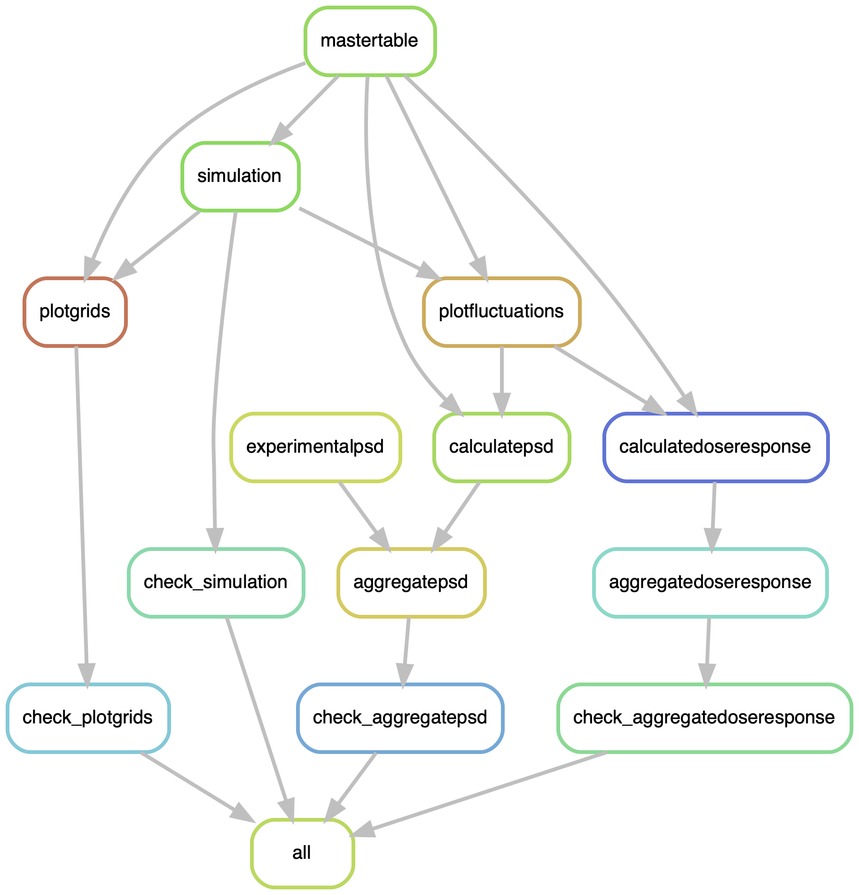

# ArrayDynamics
simulation of E. coli chemoreceptor array dynamics based on [Colin et al., eLife 2017](https://pubmed.ncbi.nlm.nih.gov/29231168/)  
*Max Planck School Matter to Life Undergraduate Research Opportunities project in the group of Dr. Remy Colin and Prof. Victor Sourjik, MPI for Terrestrial Microbiology Marburg, starting Oct 2021*

## General remarks
The pipeline relies on [Conda](https://docs.conda.io/en/latest/) and Snakemake.
In order to install Conda, click on this [link](https://docs.conda.io/en/latest/miniconda.html) and follow the installation guidelines for your respective operating system.  
After installing Conda, you need to install Snakemake. The Snakemake installation procedure is described [here](https://snakemake.readthedocs.io/en/stable/getting_started/installation.html).

R, Julia and Python need to be installed. Ideally, install them via Conda. too.

Before any execution change the following environment variable: `export JULIA_NUM_THREADS=10`

## Workflow description


Each individual script contains a header explaining input, output and task of the respective code.
Briefly, all relevant scripts are summarised in `snakefiles.py`. After parsing of the parameters specified in `features.yaml`, a master table containing all the parameters for the simulations (lattice topology, methylation, coupling energy/energies, transition rate, attractant concentration and number of replicates) is created.
Additionally, `constants.R` specifies the default parameters used for simulations.

**Note that in the current implementation, the number of replicates must equal the number of cores provided.**

For each parameter combination, on instance of the simulation script is executed. After the simulations finished, the output is used in the following ways:
* The activity of each individual core-signalling unit (CSU) in the chemoreceptor array is visualised over the simulation time course (`plotgrids`).
* The average activity and methylation level of all CSUs over time is computed. These fluctuations are used to calculate
    * Power-Spectral-Density (PSD) characteristics of the fluctuations, which are being compared to experimentally obtained spectra
    * Dose-response curves to obtain the cooperativity between individual chemoreceptor elements

Afterwards, the PSDs and dose-response curves are aggregated over the parameters that were simulated and the different behaviours are visualised.

## Simulation parameters
Are specified in `features.yaml`. Based on the list, a master table (`MASTER.csv`) is created as first step of the pipeline. The master table contains all parameter combinations tested in the simulation.
Make sure to follow the syntax in the template.
The lattice can be either *Kagome* or *Square*. In case of the Kagome lattice, the *J* parameter is a single value; in case of the *Square* lattice, please provide 3 coupling energies for the 3 different link types separated by dashes.

For the RB+ strains, only activities in absence of a chemotactic attractant will be simulated. For the RB- strains, dose-response behaviour to different attractant concentrations is sampled.

## Execution
In order to execute the entire pipeline, enter:  
```snakemake --use-conda --cores 10```  
However, it is recommended do a dry run prior to any execution:  
```snakemake --use-conda --cores 10 -n```  
You will see the rules that snakemake considers as not finished yet and will execute. Sometimes, it is desirable to execute the entire pipeline from the beginning. To do so, enter:  
```snakemake --use-conda --cores 10 -R mastertable```  
*mastertable* is the name of the first rule and the `-R` flag forces the pipeline to start at the specified rule.
